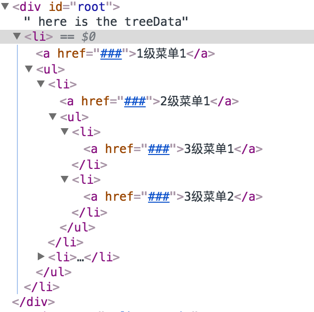
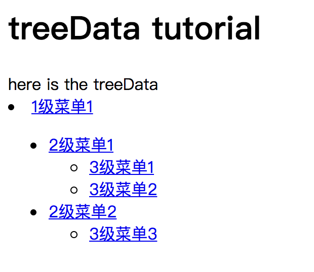

## 用JavaScript处理树形数据

#### 前言

在日常 JavaScript 的使用场景中经常会遇到树形结构，比如DOM树。


可以用以下方法去遍历 DOM 树，来自 Lucifier129 的[方法](https://github.com/Lucifier129/Lucifier129.github.io/issues/4):

```javascript
function walkDom( node, callback ){
  if ( !node ){ return;}
  callback( node );
  node = node.firstElementChild;
  while( node ){
    walkDom( node, callback );
    node = node.nextElementSibling;
  }
}
// 遍历document
walkDom( document, function( node) { 
  console.count();
});
```


如何反过来，需要把树形数据转换为如下格式后渲染到DOM：



那么可以用以下方法：

```javascript
function walk( treeData  ){
    let liElement = document.createElement("li");

    let element = document.createElement("a");
    element.setAttribute("href", treeData.link);
    element.innerHTML = treeData.name;
    liElement.appendChild( element )

    if ( !treeData.isleaf ) {
        let children = treeData.children;
        let ulElement = document.createElement("ul");
        for (let i = 0; i < children.length; i++) {
            ulElement.appendChild(walk(children[i]));
        }
        liElement.appendChild(ulElement);
    }

    return liElement;
}
```

对应处理的树形数据是这样的：

```javascript
let jsonData = {
    "name": "1级菜单1",
    "link": "###",
    "isleaf": false,
    "level": 0,
    "children": [
        {
            "name": "2级菜单1",
            "link": "###",
            "isleaf": false,
            "level": 1,
            "children": [
                {
                    "name": "3级菜单1",
                    "link": "###",
                    "isleaf": true,
                    "level": 2,
                    "children": null
                },
                {
                    "name": "3级菜单2",
                    "link": "###",
                    "isleaf": true,
                    "level": 2,
                    "children": null
                }
            ]
        },
        {
            "name": "2级菜单2",
            "link": "###",
            "isleaf": false,
            "level": 1,
            "children": [
                {
                    "name": "3级菜单3",
                    "link": "###",
                    "isleaf": true,
                    "level": 2,
                    "children": null
                }
            ]
        }
    ]
};
```

该树形数据处理效果如下：



最后总结一下用递归处理树形数据的极简版伪代码：

```javascript
function walk( treeData ){
    let el = render( treeData );
    if( treeData.haschild ) {
        for (everyChild in treeData) {
            el.appendChild( render( walk(everyChild) ) );
        }
    }
    return el;
}
```